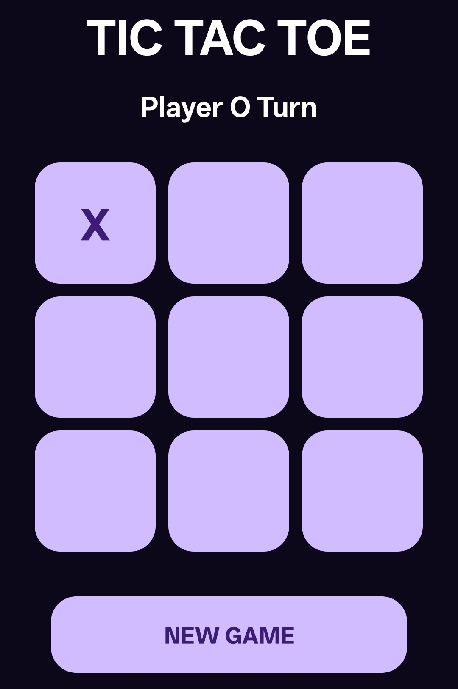
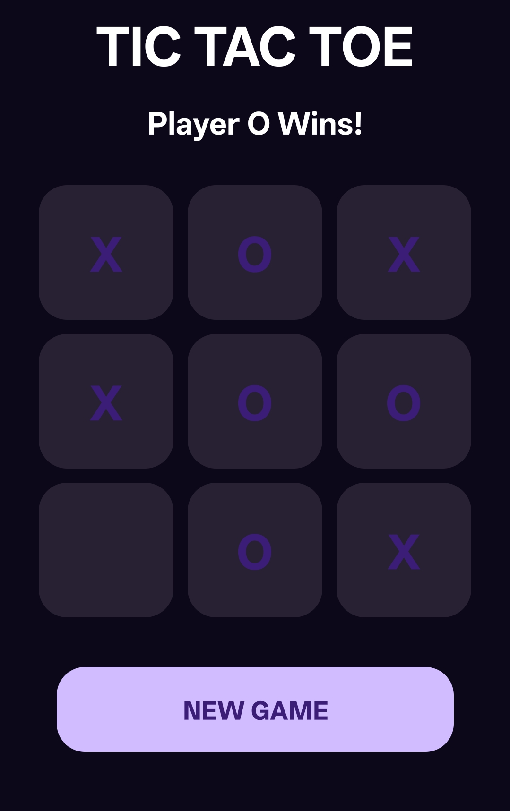
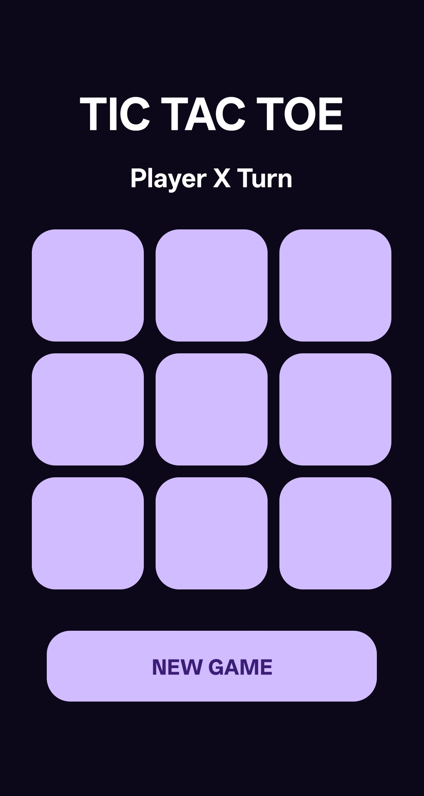
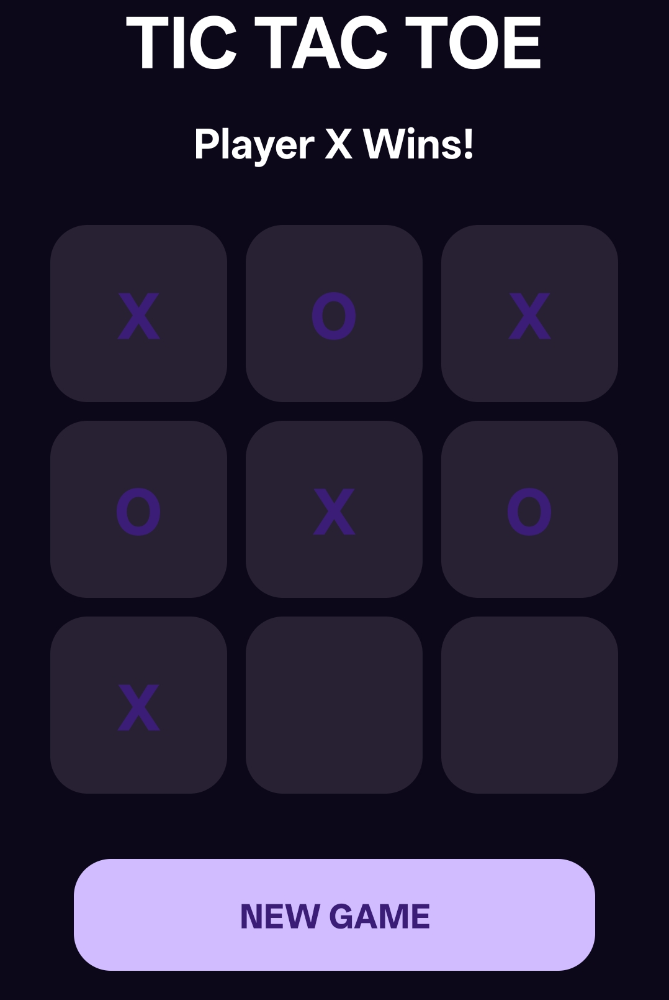

# ❌⭕ Tic Tac Toe Game

A simple Android Tic Tac Toe game developed using Java and Android Studio.

## 🚀 Features

* Two Player Gameplay (X and O)
* Alternate Player Turns
* Winner Detection
* New Game / Reset Option
* Interactive 3×3 Grid
* User-Friendly Interface

## 🛠️ Technologies Used

* Java
* Android Studio
* XML

## 📸 Screenshots

### Player O Turn

### Player O Wins

### Player X Turn

### Player X Wins

## 🎯 Learning Outcomes

* Android UI Design
* Event Handling
* Game Logic Implementation
* Winner Detection Algorithms
* User Interaction Management
* Android App Development Fundamentals

## 📂 Project Structure

* MainActivity.java
* activity_main.xml

## 👨‍💻 Author

Daksh Gajjar

## 🔗 Internship

Task-04 completed as part of the Android Development Internship at Prodigy InfoTech.
